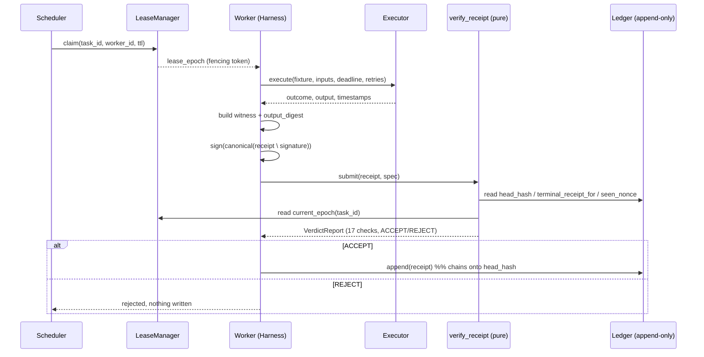

# Architecture

`vouch` answers one question: **can this claim that an agent completed a task
be believed?** It does that with three content-addressed objects, an
append-only log, and a pure verifier.

## Lifecycle of a receipt



## The receipt, and what each field binds

| Field | Binds | Notes |
|---|---|---|
| `task_id` | **task identity** | `sha256(canonical(spec))`; recomputed by the verifier |
| `task_name` | task identity | must resolve to a registered fixture |
| `run_id`, `attempt` | **run identity** | one execution attempt |
| `lease_epoch` | run identity | monotonic fencing token from the lease |
| `worker_id` | **source identity** | `ed25519:<pubkey>` |
| `runtime` | source identity | code version / python / platform / registry hash - *self-asserted* |
| `outcome` | result | `success` / `failure` / `timeout` |
| `output_digest` | result | `sha256(canonical(output))` |
| `witness` | result | proof material the verifier can cheaply re-check |
| `postconditions` | result | declared checks + pass/fail detail |
| `started_at`, `finished_at`, `deadline_at` | timing | self-reported |
| `nonce` | anti-replay | unique per receipt |
| `prev_ledger_hash` | position | ledger head at submission time |
| `signature` | integrity | Ed25519 over canonical(receipt without `signature`) |

## Verifier checks

`verify_receipt(receipt, *, spec, ledger, leases, now, expected_prev_hash)` -
every context argument optional; absent context marks its checks *skipped*,
never *failed*. It returns a `VerdictReport` and never raises.

| # | Check | Needs | Catches |
|---|---|---|---|
| 1 | `schema_parseable` | - | truncated / non-JSON / missing fields |
| 2 | `schema_version_supported` | - | version downgrade |
| 3 | `witness_size_bounded` | - | proof bomb |
| 4 | `signature_valid` | - | forgery, tamper-after-signing |
| 5 | `task_id_matches_spec` | spec | task substitution |
| 6 | `task_name_matches_spec` | spec | task substitution |
| 7 | `fixture_known` | - | unknown / renamed task |
| 8 | `witness_recheck` | spec | fabricated result |
| 9 | `output_digest_matches_witness` | - | digest / witness mismatch |
| 10 | `no_duplicate_completion` | ledger | duplicate completion |
| 11 | `nonce_unseen` | ledger | replay |
| 12 | `lease_epoch_current` | leases | stale ownership |
| 13 | `within_deadline` | - | late receipt from a timed-out run |
| 14 | `timestamps_ordered` | - | nonsensical timing |
| 15 | `not_from_the_future` | now | back/forward-dating |
| 16 | `prev_ledger_hash_matches` | head | submission out of chain order |
| 17 | `success_has_witness` | - | a bare `success` with no evidence |

## Trust boundary

```
  adversary-controlled                    |  trusted
  ------------------------------------------------------------------
  receipt bytes on the wire               |  verify_receipt() code + process
  worker private key (maybe)              |  ledger append path (harness only,
  runtime{} contents                     |    post-ACCEPT)
  started_at / finished_at               |  `now` handed to the verifier
  witness contents                       |  fixture definitions + registry
```

Everything on the left is re-derived or bounded by a check on the right.
Where that is impossible (runtime metadata, honest clocks, semantic intent
beyond the witness), it is listed under
[What this harness does not verify](README.md#what-this-harness-does-not-verify)
and staged as an accepted case in the scoreboard.

## Determinism rules

- All identifiers and signatures are computed over **canonical JSON**
  (`sort_keys`, tight separators, `allow_nan=False`).
- Fixture tasks are pure: no clock, no network, no filesystem. `slow_task`
  sleeps and `flaky_task` fails-by-attempt-number, both on purpose and both
  deterministic given their inputs.
- Wall-clock time enters through an injectable `Clock`. The single exception
  is the executor's timeout, which must race real elapsed time; the
  timestamps it records still come from the injected clock.
